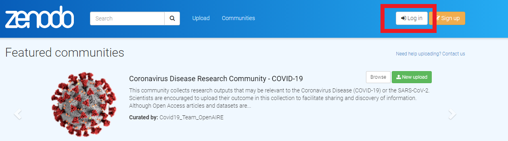

```{r setup, include=FALSE}
knitr::opts_chunk$set(echo = FALSE)
```

By request, this tutorial describes how to share a shiny app with a DOI. If you aren't interested in sharing your code with a DOI but you still want to learn about an easy way to share your app with an R-savvy audience, just follow along for the first part of the tutorial! The code we build in this tutorial is available [here](https://github.com/lsw5077/cranes). If you're just looking for info on how to host your app on shinyapps.io, check out the tutorial from [RStudio](https://shiny.rstudio.com/articles/shinyapps.html), which is way more comprehensive than I could be. 

## Step 1: Make a new github repo

This tutorial uses github, the version control and code sharing platform, to share our app code. Github is a great tool for [version control](https://guides.github.com/) and collaborative development, topics that are beyond the purview of this course but absolutely worth [learning about.](https://swcarpentry.github.io/git-novice/) For this tutorial, and for sharing your own app code, all we need to know is that github lets us store and share code and data. 

If you don't have a github account, check out [this resource](https://docs.github.com/en/github/getting-started-with-github/signing-up-for-a-new-github-account) on how to make one. For the sake of simplicity, I'm going to use github.com's point-and-click interface. However, everything we're going to do can be done from the [command line](https://docs.gitlab.com/ee/gitlab-basics/start-using-git.html) or the [github desktop application.](https://desktop.github.com/)

Once we all have github accounts, we'll make a new repository, which is an online directory to hold code, data, and metadata. Navigate to your profile page and click the green "New" button. 


We'll be prompted to choose a name for our repository, decide whether it's public or private, and have the options to add a Readme and license. We'll call our repo "cranes," make it public because we want to share it, and choose the [MIT license](https://choosealicense.com/), a common choice for sharing open source projects.


## Step 2: Add a readme

Next, we'll add a Readme so that we can give people some guidance on how to use our project. We'll instruct readers on how to access the version of the app hosted on shinyapps.io, download the app, and run the code from github. 


## Step 3: Prep our code

Now let's get our code ready to upload. We're going to upload two versions: a zipped version for folks who just want to download the code, and an unzipped version for folks who want to run the app from github. We'll make a copy of the main crane app that we used in module 3 called "craneShare" and delete the rsconnect directory from the app code. The file structure in our craneshare folder looks like the image below, with a /data folder, a /www image folder, and app.R app code. We'll also make a zipped copy of craneShare, so now we have a zipped and unzipped version of the same app directory.


## Step 4: Release our code into the world!

Our zipped file is too big to upload to github using the drag and drop utility, so we'll host it elsewhere (google drive in this case) and link to it in the Readme. The unzipped version is simpler to deal with. We simply open our unzipped /craneShare folder and then drag and drop the /data folder, /www folder, and app.R files into the repository and click "commit changes."

And there we have it! One reasonably presentable landing page with three ways to share our app:

- Hosted on shinyapps.io
- A zipped app package hosted on google drive and linked to our github page
- An unzipped set of app files that we can run from github. 


Now, any user can run our app from github simply by loading the shiny library and then running the following lines in the RStudio console or from an R script, which tells R to look for a repository called "cranes" from a user called "lsw5077" in a branch called "main." 

```{r, echo = TRUE, include = FALSE, eval = FALSE}

runGitHub(repo = "cranes", user = "lsw5077", ref = "main")

```
## Step 5: Adding a DOI to your code using Zenodo

Sharing our code on github is a nice, quick way to get it out in the world, especially if we need to share it quickly with collaborators or create the ability to use it offline. If that's all you need, you can stop here. If you want to [add a DOI to your github repo](https://guides.github.com/activities/citable-code/) in order to share it as a stable research product, e.g., as supplemental material for a publication, read on! 

### Step 5.1: Linking github and Zenodo

We're going to use zenodo to mint a DOI for the cranes app repository. [Zenodo](https://zenodo.org/) is an open access repository service (like github but for research papers and datasets) that also mints DOI's. If you connect your github account to zenodo, you can create a DOI for the github repository holding your shiny app in a few straightforward steps. First, we need to link your github account to zenodo. Simply log in to zenodo using your github account by navigating to zenodo.org and clicking "login" in the upper right-hand corner. 



Use your github login credentials to sign in by clicking "log in with github" on the sign in screen.


### Step 5.2: Enabling repositories 

Once you are logged in, click on your username/email where it appears in the upper right-hand corner of the screen, where the login link had been. 


Select the "github" tab from the profile menu. On the page, we'll see a list of github repositories. We'll see a very helpful set of instructions at the top of the page. Following the zenodo instructions, we'll set the toggle switch next to the "cranes" repository to "on" to enable zenodo to interact with the repository. Note that this screenshot already has a DOI because I was working with it previously, but yours won't yet. 


### Step 5.3: Make a release of our shiny app repository

For this step, we need to switch over to github (you could also do this step immediately after adding your code to the repository in Step 4). On the cranes repository page, click we'll click "Releases," which brings up a list of stable, versioned code versions that we've published previously.


The Releases page shows us all the existing releases and provides zip and tar files to download. This code structure is how developers can publish multiple versions of a package or tool. 


Now, we'll click the "Draft a new release" button in the upper right hand corner to start a new code release. In the new code release, we'll be prompted to choose a release version tag, title, and description. Once you fill out a version tag (e.g., v1.0), title and description, click "Publish release." Back on the repo home page, you should now be able to see the release listed on the right hand side of the repo home page.


### Step 5.4: Mint the DOI

Back at zenodo, refresh the page and you should see a shiny new DOI by your sharing-enabled repository! Click the DOI for a handly little bit of markdown syntax that we can copy and paste into our cranes readme to display the DOI to users.

If we navigate to the DOI link, it will take us to a zenodo page with an archive of our code and data that users can use to download stable code versions with metadata (sorry I forgot to show you this in the video). We can use this DOI exactly like any other: reference it in research papers, include it as supplemental material, and share it with collaborators. This might sound like a lot of steps, but I promise it's very doable and makes a very nice shiny sharing interface for scientific papers. 


## Next Steps: Shiny packages and desktop applications

As I mentioned in my overview video on hosting shiny apps, we can take our shiny deployment to the next level by creating a package for our shiny app. We can then share that packaged shiny app on github or another code sharing platform, build a desktop app around it, and even publish it to cran! 

I absolutely recommend checking out package development for shiny and in general. However, a detailed tutorial and video (or more likely several tutorials and videos), would require us to get into concepts like package development and unit testing that are outside the scope of this course. Therefore, while I'm not going to create any new content about shiny package development, I will provide a suggested workflow with a list of excellent existing tutorials for the intrepid shiny developer:

1. In preparation, read through [Engineering Shiny](https://engineering-shiny.org/) for a deep dive into production-grade shiny apps. 
2. Refactor your shiny code using [shiny modules](https://shiny.rstudio.com/articles/modules.html), which will make it much easier to develop your app into a package.
3. Use the [golem package](https://thinkr-open.github.io/golem/articles/a_start.html) to build your refactored code into a package.
4. Distribute your package using github as we've discussed, and instruct users on how to install it using [devtools](https://www.r-project.org/nosvn/pandoc/devtools.html)
5. If you are especially intrepid, consider publishing your project to [cran,](https://r-pkgs.org/index.html) if desired. 
6. Consider converting your shiny package to a desktop application using [electrocShine](https://chasemc.github.io/electricShine/)
7. Test your package using [testthat](https://testthat.r-lib.org/)


_________________________________________________________________________________________________
Article by Lyndsie Wszola